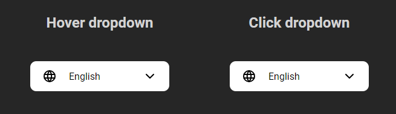
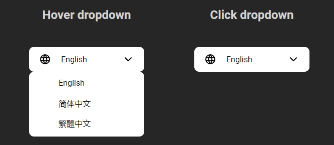

# @henrylin03/language-picker

Lightweight language picker UI component, written in vanilla JavaScript (JS).

This package was developed and published as an exercise for [The Odin Project](https://www.theodinproject.com/lessons/node-path-javascript-dynamic-user-interface-interactions).

## Installation

Install the package using npm:

```bash
npm install @henrylin03/language-picker
```

## Usage

In your JS file, import the `createLanguagePicker` function to create a dropdown of languages

```js
import createLanguagePicker from "@henrylin03/language-picker";
```

### Syntax

```js
createLanguagePicker( obj )
```

#### Parameters

`obj` is a JS object that contains several parameters required to generate your language picker. The following are its keys:

* **`containerElementCSSSelector`** (string): CSS selector of the container (parent) element where the language picker will be appended as a child.

  * If not provided, the language picker will be appended to the `<body>` of the document

* **`languages`** (array): array of language strings to display in the dropdown. The first language in the array will be the initial selected language, and displayed on the button that triggers the dropdown.

  * If not provided, the only language will be "English"

* **`expandEvent`** (string): specifies the type of user interaction that will expand the language picker.

  * **Valid values**: `"hover"`, `"click"`
  * If not provided, the dropdown will be expanded on a click event

### Example

#### HTML

```html
<!DOCTYPE html>
<html lang="en">
<head>
  <meta charset="UTF-8">
  <meta name="viewport" content="width=device-width, initial-scale=1.0">
  <title>DEMO</title>
</head>
<body>
  <section id="hover-dropdown">
    <h2>Hover dropdown</h2>
  </section>
  <section id="click-dropdown">
    <h2>Click dropdown</h2>
  </section>
  
  <script type="module">
    import createDropdown from '@henrylin03/ui-dropdown';

    const LANGUAGES = ["English", "简体中文", "繁體中文"];

    const clickDropdownOptions = {
      containerElementCSSSelector: "#click-dropdown",
      expandEvent: "click",
      languages: LANGUAGES,
    };
    const hoverDropdownOptions = {
      containerElementCSSSelector: "#hover-dropdown",
      expandEvent: "hover",
      languages: LANGUAGES,
    };

    createDropdown(clickDropdownOptions);
    createDropdown(hoverDropdownOptions);
  </script>

</body>
</html>
```

#### Initial state



#### Expanded


